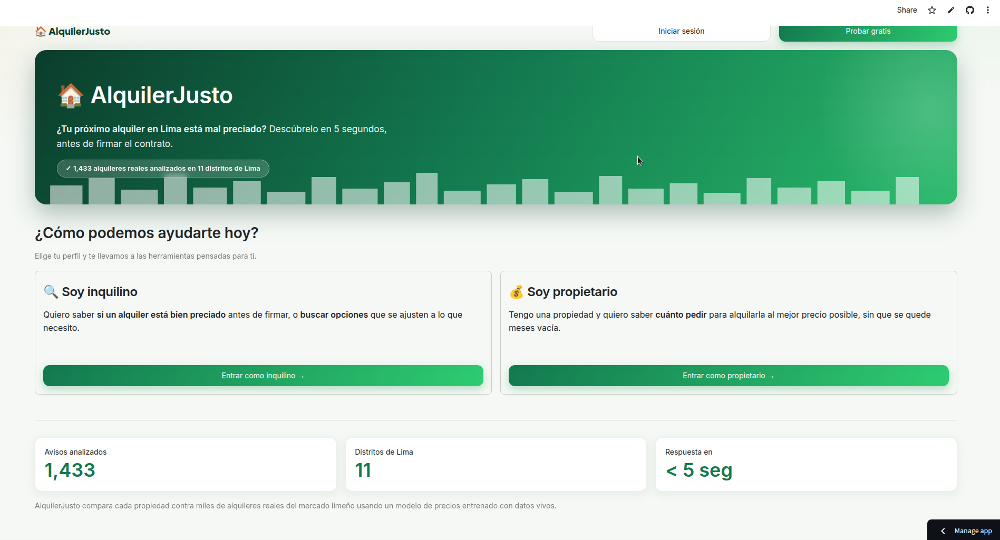
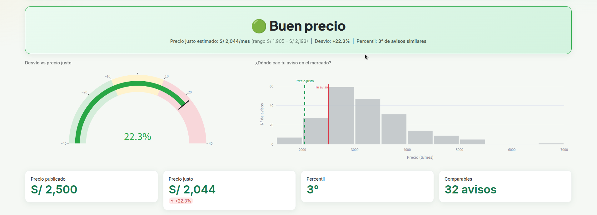
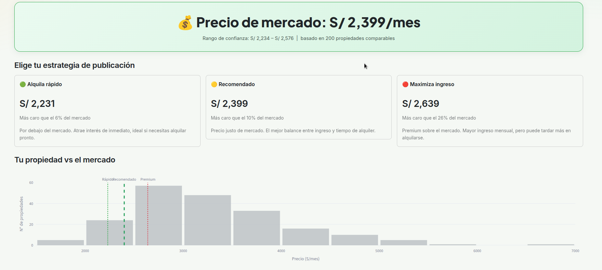
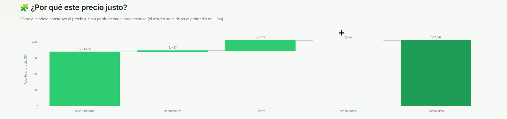
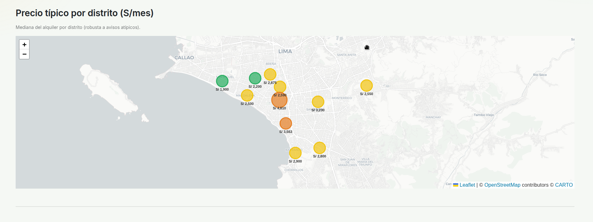

# AlquilerJusto

> ¿Tu próximo alquiler en Lima está mal preciado? Te lo decimos en 5 segundos.

[](https://alquiler-justo.streamlit.app)

---

## El problema

Buscar departamento en Lima toma entre 4 y 8 semanas. No es por falta de oferta — Urbania, Adondevivir y Properati tienen más de 30,000 avisos activos — sino porque ningún portal te dice si el precio de un aviso específico es justo. Decidir se vuelve apuesta a ciegas: ¿2,500 soles por un 2 dorm de 70 m² en Miraflores es caro, justo o regalado?

## La solución

AlquilerJusto scrapea avisos de Infocasas.pe, los normaliza automáticamente (m², dormitorios, amenities, piso, distrito), y los compara contra un modelo hedónico entrenado sobre ~1,400 avisos reales de Lima. Pegás el URL o completás el formulario y en menos de 5 segundos obtenés:

- **Precio justo de mercado** estimado por el modelo
- **Percentil** contra avisos similares en la misma zona
- **Veredicto**: 🟢 buen precio / 🟡 justo / 🔴 sobrevalorado
- **5 comparables reales** como evidencia

## Demo

**URL**: https://alquiler-justo.streamlit.app

### Capturas

| Inicio | Veredicto | Tasar propiedad |
|---|---|---|
|  |  |  |

| ¿Por qué este precio? | Mapa de precios |
|---|---|
|  |  |

## Arquitectura

```
Infocasas.pe ──scraping──► SQLite (1,475 avisos)
                                │
                          OLS hedónico
                     ln(precio) ~ ln(m²) + dorms + baños
                     + piso + distrito + amenities
                          R² = 0.824  n = 1,445
                                │
                        Streamlit frontend
                    ┌───────────┴──────────────┐
              Analizar aviso           Mapa Folium
           (veredicto + comparables)  (precios por distrito)
```

## Herramientas del curso utilizadas

| Herramienta | Lectura | Dónde en el código |
|---|---|---|
| Web scraping (requests + BeautifulSoup) | 2-3 | `scraping/infocasas.py` |
| GeoPandas + Folium + Streamlit | 3-7 | `frontend/app.py` |
| Regresión hedónica (statsmodels OLS) | 8-10 | `backend/app/model.py` |
| Claude API (parseo de búsqueda en lenguaje natural, con fallback) | 14 | `ai/assistant.py` |

## Resultados del modelo

| Métrica | Valor |
|---|---|
| R² | 0.824 |
| R² ajustado | 0.822 |
| RMSE | ~25% del precio medio |
| Observaciones | 1,445 avisos |
| Distritos | 11 distritos de Lima Metropolitana |

**Lecturas del modelo** (log-lineal, errores robustos HC1):
- `log(m²)` → +0.72 (elasticidad precio-área: doblar el área ≈ +65% precio)
- Amenidades: **vista al mar ≈ +10%**, ascensor ≈ +8%, amoblado ≈ +8%, cochera ≈ +5%
  - (se probó cercanía a parques, pero no resultó significativa — colinealidad con distrito)
- Distritos más caros (mediana): San Isidro S/4,800, Miraflores S/3,563, San Borja S/3,224
- Más accesibles: San Miguel S/1,900, Pueblo Libre S/2,200

## Estructura del repo

```
alquiler-justo/
├── frontend/app.py          # Streamlit UI (inicio, analizar, tasar, asistente, mapa)
├── backend/app/
│   ├── model.py             # OLS hedónico + predicción
│   └── comparables.py       # top-5 avisos similares
├── scraping/
│   ├── infocasas.py         # scraper principal (~1,475 avisos)
│   ├── listing_parser.py    # fetch de URL individual
│   └── utils.py             # SQLite helpers + rate limiter
├── data/
│   ├── listings.db          # ~1,475 avisos (SQLite)
│   └── samples/             # muestra 60 filas para el repo
├── notebooks/
│   └── 01_eda.ipynb         # EDA: distribuciones, correlaciones, residuos
└── docs/                    # pitch deck, entrevistas, arquitectura
```

## Cómo correrlo localmente

```bash
git clone https://github.com/nvcodes-git/alquiler-justo.git
cd alquiler-justo
python -m venv .venv && source .venv/bin/activate
pip install -r requirements.txt
streamlit run frontend/app.py
```

No requiere API key para el flujo principal. La DB (`data/listings.db`) ya está incluida en el repo.

## Roadmap

- [x] Scraper Infocasas (~1,475 avisos, 11 distritos)
- [x] Modelo hedónico OLS — R² = 0.82
- [x] Streamlit con formulario + mapa Folium
- [x] Deploy público en Streamlit Cloud
- [ ] Parser de URL para cualquier aviso de Infocasas
- [ ] Alertas diarias por WhatsApp (crewAI + OpenClaw)
- [ ] Expansión a Adondevivir y Properati
- [ ] Seguimiento días-en-mercado (validación externa del modelo)
- [ ] Dashboard para corredores inmobiliarios

## Founder

Nicolás Villar — Economía, Universidad del Pacífico. Proyecto final *Data Science con Python 2026-I* (Prof. Alexander Quispe).

## Licencia

MIT
